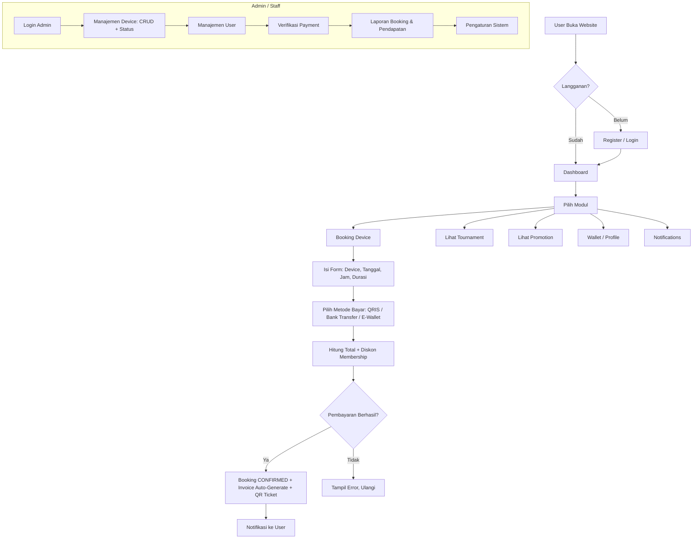
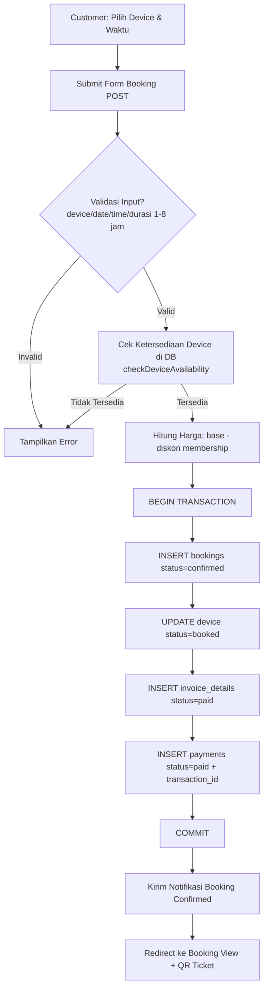
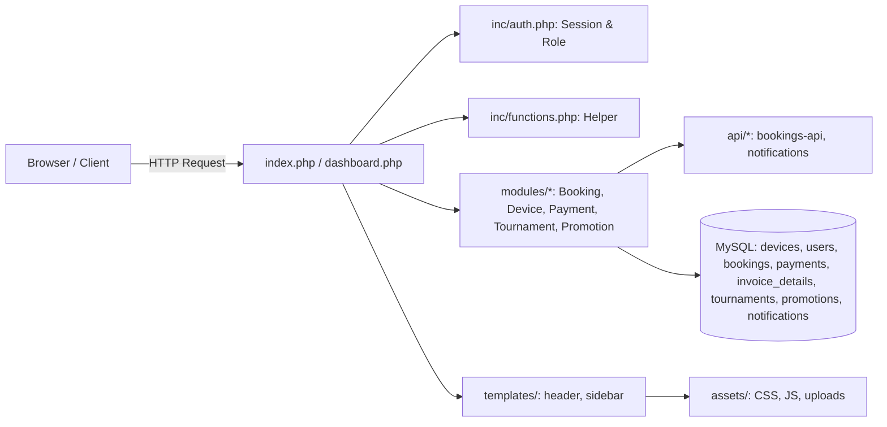
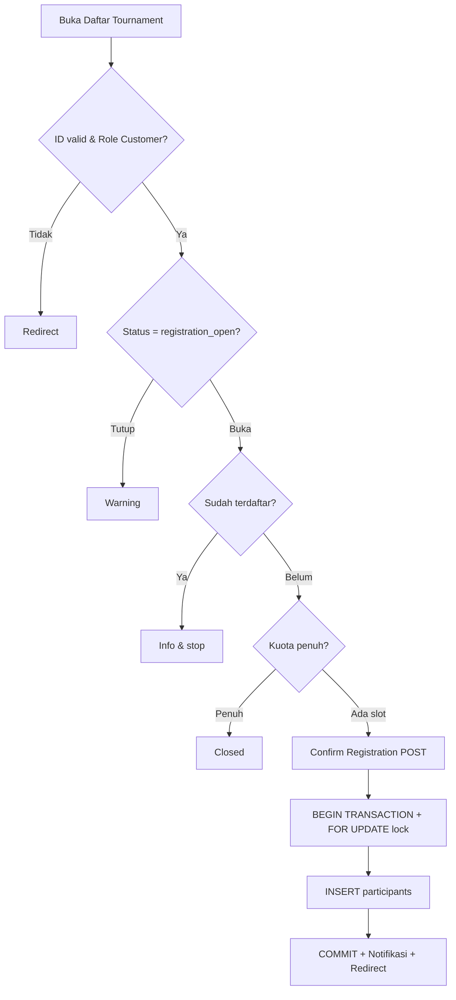
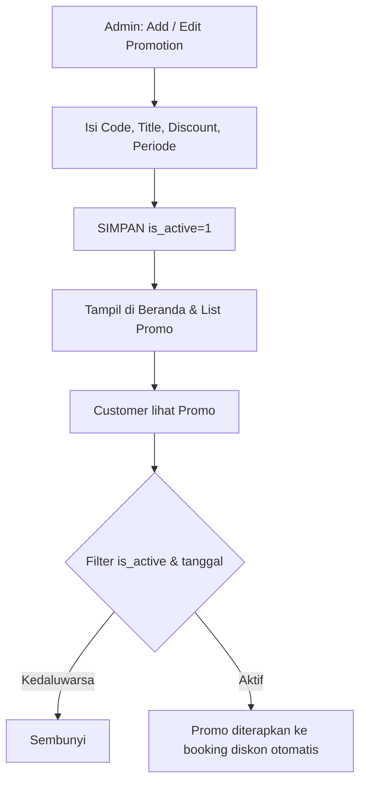

# Flowchart Sistem GameZone — Rental Warnet & PS

Sistem manajemen rental warnet & PS berbasis **PHP Native 8+** dan **MySQL/MariaDB**.

---

## 1. Flowchart Alur Umum (User & Admin)

---

## 2. Flowchart Detail Proses Booking + Pembayaran

---

## 3. Flowchart Arsitektur Sistem

---

## 4. Pembagian Modul per Anggota

| Anggota | Modul | File Utama |
|---------|-------|-----------|
| Hafiz | Auth & User | login.php, register.php, modules/users/ |
| Rafli | Device | modules/devices/ |
| Dika | Booking & API | modules/bookings/, api/bookings-api.php |
| Iyas | Payment & Invoice | modules/payments/, modules/invoices/ |
| Mico | Promotion, Tournament, Notification | modules/promotions/, modules/tournaments/, api/notifications.php |
| Adi | Dashboard, Reports, Settings | dashboard.php, modules/reports/, modules/settings/ |

---

## 6. Flowchart Tournament

---

## 7. Flowchart Promotion

---

## 5. Tech Stack

- **Frontend:** HTML5, CSS3, JavaScript, Bootstrap 5, Tailwind (CDN)
- **Backend:** PHP Native 8+
- **Database:** MySQL / MariaDB
- **Keamanan:** password_hash, CSRF token, session httpOnly + sameSite
